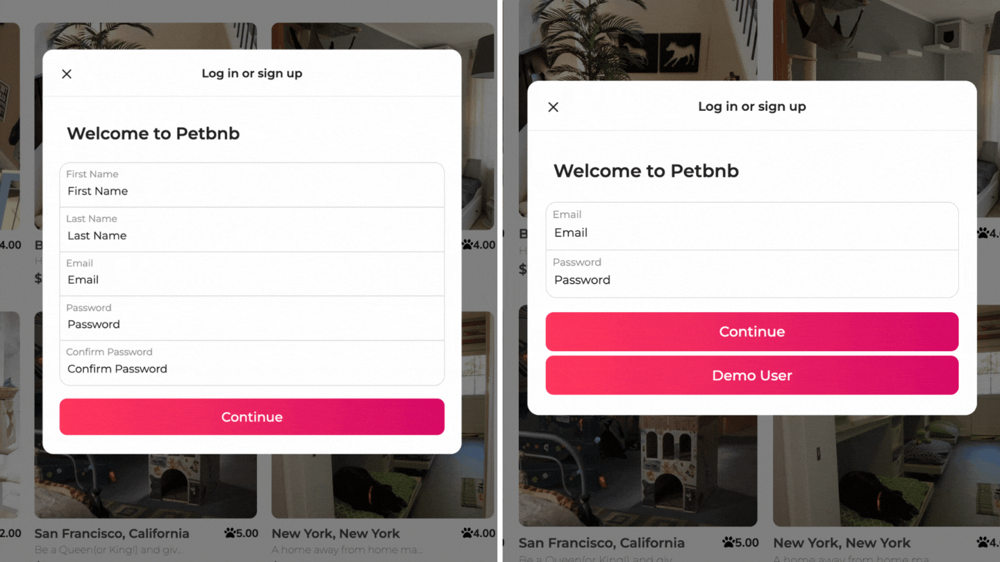

# Welcome to Petbnb 

 > Petbnb is my very first solo fullstack web application project. Yes, Petbnb, is exactly what you think it is: Airbnb for our pets! Petbnb offers a variety of home environment pet boarding services for all pets!


<div align="center">

### **My [Airbnb](https://www.airbnb.com/) Clone**
### **[Visit Petbnb!](https://airbnb4pets.herokuapp.com/)**
### [Petbnb Wiki](https://github.com/jvstinejvng/Airbnb_Clone/wiki)
### [Current Features](https://github.com/jvstinejvng/Airbnb_Clone/wiki/Current-Features)
### [Database Schema](https://github.com/jvstinejvng/Airbnb_Clone/wiki/Database-Schema)
### [Redux State Shape](https://github.com/jvstinejvng/Airbnb_Clone/wiki/Redux-State-Shape)
</div>

<div align="center">
* * *

## **Technologies Used**

| React | Redux | Express.js | Node.js | PostgreSQL | Sequelize |
|:-----:|:-----:|:-------:|------------|:----------:|:---------:|
|<a href="https://reactjs.org/"></a>|<a href='https://redux.js.org/'></a>|<a href='https://expressjs.com/'></a>|<a href='https://nodejs.org/en/'></a>|<a href='https://www.postgresql.org/'></a>|<a href='https://sequelize.org/'></a>|

</div>

<div align="center">

## **Other Softwares**

| VSCode | Git | Heroku |
|:-----:|:-----:|:-------:|

<a href='https://code.visualstudio.com/'></a><a href='https://git-scm.com/'></a><a href='https://www.heroku.com/'></a>

* * * * * *
</div>

<div>

## **Application Features:**

1. Sign up, log in & demo user 
2. HomePage
3. Listing detail page
4. Create and edit a listing 
5. All user's reviews
6. All user's listings
7. Create a review 


---------------------------------------------------------------------------
</div>
<div>

## **Installation Instructions:**
- [ ] Clone the resposity
    ```
    git clone git@github.com:jvstinejvng/Airbnb_Clone.git
    ```
 - [ ] Install dependencies in frontend and backend directories
    ```
    npm install
    ```
- [ ] Run the server: 
    1. Backend directory
    2. Frontend directory
    ```
    npm start
    ```

-------------------------------------------------------------------------
</div>

## **Future Features:**
- Search Bar
- Filter Content List
- Booking Options
- Location Mapping 
- Favorite Listings 

---------------------------------------------------------------------------
> ### _Built by_ [_Justine Jang_](https://github.com/jvstinejvng)

